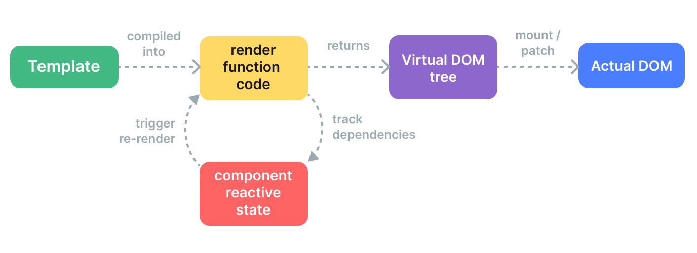

# 虚拟 DOM：是一种编程概念，意为将目标所需的 UI 通过数据结构“虚拟”地表示出来，保存在内存中，然后将真实的 DOM 与之保持同步
# 渲染管线
## 编译：Vue 模板被编译为渲染函数：即用来返回虚拟 DOM 树的函数
## 挂载：运行时渲染器调用渲染函数，遍历返回的虚拟 DOM 树，并基于它创建实际的 DOM 节点
## 更新：当一个依赖发生变化后，副作用会重新运行，这时候会创建一个更新后的虚拟 DOM 树
## 流程图


# 静态提升
```
<div>
  <div>foo</div> <!-- 需提升 -->
  <div>bar</div> <!-- 需提升 -->
  <div>{{ dynamic }}</div>
</div>
```
## Vue 编译器自动地会提升这部分 vnode 创建函数到这个模板的渲染函数之外，并在每次渲染时都使用这份相同的 vnode，渲染器知道新旧 vnode 在这部分是完全相同的

# 更新类型标记
```
<!-- 仅含 class 绑定 -->
<div :class="{ active }"></div>

<!-- 仅含 id 和 value 绑定 -->
<input :id="id" :value="value">

<!-- 仅含文本子节点 -->
<div>{{ dynamic }}</div>

```
```
createElementVNode("div", {
  class: _normalizeClass({ active: _ctx.active })
}, null, 2 /* CLASS 2 为更新类型标记 */)

```
## 这些元素生成渲染函数时，Vue 在 vnode 创建调用中直接编码了每个元素所需的更新类型。一个元素可以有多个更新类型标记，会被合并成一个数字。运行时渲染器也将会使用位运算来检查这些标记，确定相应的更新操作
## 完整更新类型标记：<a href='https://github.com/vuejs/core/blob/main/packages/shared/src/patchFlags.ts'>更新类型标记</a>

# 树结构打平 
## 区块:内部结构是稳定的一个部分可被称之为一个区块(Block)
```
<div> <!-- root block -->
  <div>...</div>         <!-- 不会追踪 -->
  <div :id="id"></div>   <!-- 要追踪 -->
  <div>                  <!-- 不会追踪 -->
    <div>{{ bar }}</div> <!-- 要追踪 -->
  </div>
</div>
<!-- 编译结果 -->
div (block root)
- div 带有 :id 绑定
- div 带有 {{ bar }} 绑定

```
## 当需要更新的时候，只需要遍历这个打平的树而非整棵树

## Block Tree: 参考 <a href='./Block Tree.md'>Block Tree</a>