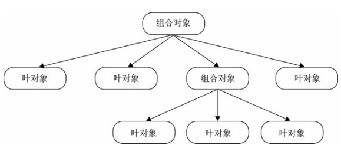

# 设计模式的六大原则

## 单一职责原则（Single Responsibility Principle）：一个类或者一个方法只负责一项职责，尽量做到类的只有一个行为原因引起变化；

a、业务对象（BO business object）、业务逻辑（BL business logic）拆分；

## 里氏替换原则（LSP liskov substitution principle）：子类可以扩展父类的功能，但不能改变原有父类的功能；

（目的：增强程序的健壮性）实际项目中，每个子类对应不同的业务含义，使父类作为参数，传递不同的子类完成不同的业务逻辑。

## 依赖倒置原则（dependence inversion principle）：面向接口编程；（通过接口作为参数实现应用场景）

抽象就是接口或者抽象类，细节就是实现类

含义：

-   上层模块不应该依赖下层模块，两者应依赖其抽象；

-   抽象不应该依赖细节，细节应该依赖抽象；

-   通俗点就是说变量或者传参数，尽量使用抽象类，或者接口；

-   【接口负责定义 public 属性和方法，并且申明与其他对象依赖关系，抽象类负责公共构造部分的实现，实现类准确的实现业务逻辑】

## 接口隔离（interface segregation principle）：建立单一接口；（扩展为类也是一种接口，一切皆接口）

定义：

a.客户端不应该依赖它不需要的接口；

b.类之间依赖关系应该建立在最小的接口上；

简单理解：复杂的接口，根据业务拆分成多个简单接口；（对于有些业务的拆分多看看适配器的应用）

【接口的设计粒度越小，系统越灵活，但是灵活的同时结构复杂性提高，开发难度也会变大，维护性降低】

## 迪米特原则（law of demeter LOD）：最少知道原则，尽量降低类与类之间的耦合；

一个对象应该对其他对象有最少的了解

## 开闭原则（open closed principle）：用抽象构建架构，用实现扩展原则；（总纲）

（solid 稳定的 记忆首字母）

# 常见设计模式

## 工厂模式

### 定义：以工厂函数方法，返回一个全新的实例

### 实现：

```
function createPerson(name,age,job){
    var obj = new Object();
    obj.name = name;
    obj.age = age;
    obj.job = job;
    obj.speak = function(){
        console.log(this.name);
    };
    return obj
}
var person1 = createPerson('panrui',20,'前端工程师')
```

### 优点:解决了创建多个对象的问题

### 缺点：是没有结解决对象识别的问题(怎样知道一个对象的类型)

## 构造函数模式

### 定义：工厂模式上没有显示的创建对象,没有返回语句,直接将属性赋给 this 对象

### 实现：

```
function Person(name,age,job){
    this.name = name;
    this.age = age;
    this.job = job;
    this.speak = function(){
        console.log(this.name);
    };
}
var person2 = new Person('panrui',20,'前端工程师')
```

### 优点：不要反悔新实例对象

### 缺点：每个方法在每个实例上面都需要重新定义一遍

## 原型模式

### 定义：通过原型添加属性方法，最后实例化

### 实现

```
function Person(){

}
Person.prototype.name = 'panrui';
Person.prototype.age = 23;
Person.prototype.job = '前端工程师';
Person.prototype.speak = function(){
    console.log(this.name)
}
var person3 = new Person()
```

### 优点：省略了为构造函数传递初始化参数,所有实例享有相同的属性

### 缺点：实例享有相同的属性可能会被覆盖

## 单例模式

### 定义：保证一个类仅有一个实例，并提供一个访问它的全局访问点

### 核心：确保只有一个实例，并提供全局访问

### 场景：弹窗，dialog, message

## 策略模式

### 定义：定义一系列的算法或者业务规则，把他们一个个封装起来，并且使他们可以相互替换

### 核心：将算法或者业务规则的使用和实现分离开来。

-   一个基于策略模式的程序至少由两部分组成：

-   第一个部分是一组策略类，策略类封装了具体的算法，并负责具体的计算过程。

-   第二个部分是环境类 Context，Context 接受客户的请求，随后把请求委托给某一个策略类。要做到这点，说明 Context 中要维持对某个策略对象的引用

### 场景：表单的验证

```
function Validator() {
    this.items = [];
};

Validator.prototype = {
    constructor: Validator,
    // 添加校验规则
    add: function(value, rule, errorMsg) {

    },

    // 开始校验
    start: function() {}
}
```

## 代理模式

### 定义：为一个对象提供一个代用品或占位符，以便控制对它的访问

### 核心：中间代理处理请求，在把请求发送给主体，类似中间件

### 场景：拦截器，过滤器

```
// 主体，发送消息
function sendMsg(msg) {
    console.log(msg);
}
// 代理，对消息进行过滤
function proxySendMsg(msg) {
    // 无消息则直接返回
    if (typeof msg === 'undefined') {
        console.log('deny');
        return;
    }
    // 有消息则进行过滤
    msg = ('' + msg).replace(/泥\s*煤/g, '');

    sendMsg(msg);
}

proxySendMsg('泥煤呀泥 煤'); // 呀
```

### 优点：可以有效地避免多重条件语句，将一系列方法封装起来也更直观，利于维护

### 缺点：往往策略集会比较多，我们需要事先就了解定义好所有的情况

## 观察者模式

### 定义：一个目标对象管理所有相依于它的观察者对象，并且在它本身的状态改变时主动发出通知,二者是直接关联的。观察者模式在应用中往往是同步的，当被观察者一旦有变化，观察者会立即做出响应

## 发布-订阅模式

### 定义：是观察者模式的一种变体，定义了对象间的一种一对多的依赖关系，当一个对象的状态发 生改变时，所有依赖于它的对象都将得到通知。发布者与订阅者之间是解耦的，他们之间是通过一个介质通信结构（事件通道）。这个事件通道会处理发布者发布的不同类型的通知，并且将这些通知发送给相应的订阅者。发布订阅者模式由于消息队列代理的存在，往往是异步的

### 核心：以注册回调函数的形式来实现订阅，其中通知属于发布，注册回调属于订阅

### 场景：js 中的事件，vue 的响应式

```
// 订阅
document.body.addEventListener('click', function() {
    console.log('click1');
}, false);
// 发布
document.body.click();
```

### 优点：一为时间上的解耦，二为对象之间的解耦。可以用在异步编程中与 MV\*框架中

### 缺点：创建订阅者本身要消耗一定的时间和内存，订阅的处理函数不一定会被执行，驻留内存有性能开销弱化了对象之间的联系，复杂的情况下可能会导致程序难以跟踪维护和理解

## 装饰器模式

### 定义：以动态地给某个对象添加一些额外的职责，而不会影响从这个类中派生的其他对象。是一种“即用即付”的方式，能够在不改变对 象自身的基础上，在程序运行期间给对象动态地 添加职责

### 核心：为对象动态加入行为，经过多重包装，可以形成一条装饰链

### 场景实现：react 中的装饰器

```
function Person() {}

Person.prototype.skill = function() {
    console.log('数学');
};

// 装饰器，还会音乐
function MusicDecorator(person) {
    this.person = person;
}
var person1 = new MusicDecorator(person);
```

## 迭代器模式

### 定义：指提供一种方法顺序访问一个聚合对象中的各个元素，而又不需要暴露该对象的内部表示

### 核心：在使用迭代器模式之后，即使不关心对象的内部构造，也可以按顺序访问其中的每个元素

### 场景：数组的遍历，对象 key 的遍历

```
[1,2,3].forEach()
```

## 命令模式

### 定义：用一种松耦合的方式来设计程序，使得请求发送者和请求接收者能够消除彼此之间的耦合关系命令（command）指的是一个执行某些特定事情的指令

### 核心：命令中带有 execute 执行、undo 撤销、redo 重做等相关命令方法，建议显示地指示这些方法名

### 实现（与策略模式很相似）

```
var incrementCommand = {
    execute: function() {
        // something
    },
    add(){

    },
    remove(){}
};
```

## 组合模式

### 定义：是用小的子对象来构建更大的 对象，而这些小的子对象本身也许是由更小 的“孙对象”构成的

### 核心：树形结构，它是一种 HAS-A（聚合）的关系，将请求委托给 它所包含的所有叶对象。基于这种委托，就需要保证组合对象和叶对象拥有相同的接口



```
// 文件夹 组合对象
function Folder(name) {
    this.name = name;
    this.parent = null;
    this.files = [];
}

Folder.prototype = { constructor: Folder,
    add: function(file) {
        file.parent = this;
        this.files.push(file);
        return this;
    },
    scan: function() {
        // 委托给叶对象处理
        for (var i = 0; i < this.files.length; ++i) {
            this.files[i].scan();
        }
    },
    remove: function(file) {
        if (typeof file === 'undefined') {
            this.files = [];
            return;
        }
        for (var i = 0; i < this.files.length; ++i) {
            if (this.files[i] === file) {
                this.files.splice(i, 1);
            }
        }
    }
};
// 文件 叶对象 function File(name) { this.name = name; this.parent = null; }
File.prototype = { constructor: File,
    add: function() {
        console.log('文件里面不能添加文件');
    },
    scan: function() {
        var name = [this.name];
        var parent = this.parent;
        while (parent) {
            name.unshift(parent.name);
            parent = parent.parent;
        }
        console.log(name.join(' / '));
    }

};

```

### 优点：可以方便地构造一棵树来表示对象的部分-整体 结构。在树的构造最终 完成之后，只需要通过请求树的最顶层对 象，便能对整棵树做统一一致的操作。

### 缺点：创建出来的对象长得都差不多，可能会使代码不好理解，创建太多的对象对性能也会有一些影响

## 适配器模式

### 定义：是解决两个软件实体间的接口不兼容的问题，对不兼容的部分进行适配

### 核心：解决两个已有接口之间不匹配的问题，其实就是相互补充和完善

### 场景：

```

/ 渲染数据，格式限制为数组了 function renderData(data) { data.forEach(function(item) { console.log(item); }); }

// 对非数组的进行转换适配 function arrayAdapter(data) { if (typeof data !== 'object') { return []; }

    if (Object.prototype.toString.call(data) === '[object Array]') {
        return data;
    }
    // 解决传入对象的适配问题
    var temp = [];

    for (var item in data) {
        if (data.hasOwnProperty(item)) {
            temp.push(data[item]);
        }
    }
    return temp;

}

var data = { 0: 'A', 1: 'B', 2: 'C' };

renderData(arrayAdapter(data)); // A B C

```

## 模版方法模式

### 定义：模板方法模式由两部分结构组成，第一部分是抽象父类，第二部分是具体的实现子类

### 核心：在抽象父类中封装子类的算法框架，它的 init 方法可作为一个算法的模板，指导子类以何种顺序去执行哪些方法。由父类分离出公共部分，要求子类重写某些父类的（易变化的）抽象方法

### 实现：

```
// 体育运动
function Sport() {}
Sport.prototype = {
    constructor: Sport,
    // 模板，按顺序执行
    init: function() {
        this.stretch();
        this.jog();
        this.deepBreath();
        this.start();
        var free = this.end();
        // 运动后还有空的话，就拉伸一下
        if (free !== false) {
            this.stretch();
        }
    },
    // 拉伸
    stretch: function() {
        console.log('拉伸');
    },
    // 慢跑
    jog: function() {
        console.log('慢跑');
    },
    // 深呼吸
    deepBreath: function() {
        console.log('深呼吸');
    },
    // 开始运动
    start: function() {
        throw new Error('子类必须重写此方法');
    },
    // 结束运动
    end: function() {
        console.log('运动结束');
    }
};

// 篮球
function Basketball() {}
Basketball.prototype = new Sport();
// 重写相关的方法
Basketball.prototype.start = function() {
    console.log('先投上几个三分');
};
Basketball.prototype.end = function() {
    console.log('运动结束了，有事先走一步');
    return false;
};
// 马拉松
function Marathon() {}
Marathon.prototype = new Sport();
var basketball = new Basketball();
var marathon = new Marathon();
// 子类调用，最终会按照父类定义的顺序执行
basketball.init();
marathon.init();
```

## 享元模式：

### 定义：享元（flyweight）模式是一种用于性能优化的模式，它的目标是尽量减少共享对象的数量享元（flyweight）模式是一种用于性能优化的模式，它的目标是尽量减少共享对象的数量

### 核心：运用共享技术来有效支持大量细粒度的对象。强调将对象的属性划分为内部状态（属性）与外部状态（属性）。内部状态用于对象的共享，通常不变；而外部状态则剥离开来，由具体的场景决定

### 实现：将多个对象的公共部分（内部状态）抽离出来，与外部状态独立。其他属性都属于外部状态，变化的部分则在外部维护。常用原始工厂模式加组合原型方式

```
// 健康测量
function Fitness(sex) {
    this.sex = sex;
}

// 工厂，创建可共享的对象
var FitnessFactory = {
    objs: [],
    create: function(sex) {
        if (!this.objs[sex]) {
            this.objs[sex] = new Fitness(sex);
        }
        return this.objs[sex];
    }
};

// 管理器，管理非共享的部分
var FitnessManager = {
    fitnessData: {},
    // 添加一项
    add: function(name, sex, age, height, weight) {
        var fitness = FitnessFactory.create(sex);
        // 存储变化的数据
        this.fitnessData[name] = {
            age: age,
            height: height,
            weight: weight
        };
        return fitness;
    },

    // 从存储的数据中获取，更新至当前正在使用的对象
    updateFitnessData: function(name, obj) {
        var fitnessData = this.fitnessData[name];

        for (var item in fitnessData) {
            if (fitnessData.hasOwnProperty(item)) {
                obj[item] = fitnessData[item];
            }
        }
    }
};

// 开始评判
Fitness.prototype.judge = function(name) {
    // 操作前先更新当前状态（从外部状态管理器中获取）
    FitnessManager.updateFitnessData(name, this);
    var ret = name + ': ';
    if (this.sex === 'male') {
        ret += this.judgeMale();
    } else {
        ret += this.judgeFemale();
    }
    console.log(ret);
};

// 男性评判规则
Fitness.prototype.judgeMale = function() {
    var ratio = this.height / this.weight;
    return this.age > 20 ? (ratio > 3.5) : (ratio > 2.8);
};
// 女性评判规则
Fitness.prototype.judgeFemale = function() {
    var ratio = this.height / this.weight;
    return this.age > 20 ? (ratio > 4) : (ratio > 3);
};
var a = FitnessManager.add('A', 'male', 18, 160, 80);
var b = FitnessManager.add('B', 'male', 21, 180, 70);
var c = FitnessManager.add('C', 'female', 28, 160, 80);
var d = FitnessManager.add('D', 'male', 18, 170, 60);
var e = FitnessManager.add('E', 'female', 18, 160, 40);
// 开始评判
a.judge('A'); // A: false
b.judge('B'); // B: false
c.judge('C'); // C: false
d.judge('D'); // D: true
e.judge('E'); // E: true
```

## 职责链模式

### 定义：使多个对象都有机会处理请求，从而避免请求的发送者和接收者之间的耦合关系，将这些对象连成一条链，并沿着这条链 传递该请求，直到有一个对象处理它为止

### 核心：请求发送者只需要知道链中的第一个节点，弱化发送者和一组接收者之间的强联系，可以便捷地在职责链中增加或删除一个节点，同样地，指定谁是第一个节点也很便捷

### 实现：

```
// 定义链的某一项
function ChainItem(fn) {
    this.fn = fn;
    this.next = null;
}

ChainItem.prototype = {
    constructor: ChainItem,

    // 设置下一项
    setNext: function(next) {
        this.next = next;
        return next;
    },

    // 开始执行
    start: function() {
        this.fn.apply(this, arguments);
    },

    // 转到链的下一项执行
    toNext: function() {
        if (this.next) {
            this.start.apply(this.next, arguments);
        } else {
            console.log('无匹配的执行项目');
        }
    }
};

// 展示数字
function showNumber(num) {
    if (typeof num === 'number') {
        console.log('number', num);
    } else {
        // 转移到下一项
        this.toNext(num);
    }
}

// 展示字符串
function showString(str) {
    if (typeof str === 'string') {
        console.log('string', str);
    } else {
        this.toNext(str);
    }
}

// 展示对象
function showObject(obj) {
    if (typeof obj === 'object') {
        console.log('object', obj);
    } else {
        this.toNext(obj);
    }
}

var chainNumber = new ChainItem(showNumber);
var chainString = new ChainItem(showString);
var chainObject = new ChainItem(showObject);

// 设置链条
chainObject.setNext(chainNumber).setNext(chainString);

chainString.start('12'); // string 12
chainNumber.start({}); // 无匹配的执行项目
chainObject.start({}); // object {}
chainObject.start(123); // number 123
```

## 中介者模式

### 定义：所有的相关 对象都通过中介者对象来通信，而不是互相引用，所以当一个对象发生改变时，只需要通知中介者对象即可

### 核心：使网状的多对多关系变成了相对简单的一对多关系（复杂的调度处理都交给中介者）

### 实现：处理过程抽离出来，封装成中介者来处理，各项需要处理时，通知中介者即可。与代理模式有些相似，都有一个中间者，只不过中间者的功能不一样

```
var A = {
    score: 10,
    changeTo: function(score) {
        this.score = score;
        // 自己获取
        this.getRank();
    },
    // 直接获取
    getRank: function() {
        var scores = [this.score, B.score, C.score].sort(function(a, b) {
            return a < b;
        });
        console.log(scores.indexOf(this.score) + 1);
    }
};

var B = {
    score: 20,
    changeTo: function(score) {
        this.score = score;
        // 通过中介者获取
        rankMediator(B);
    }
};

var C = {
    score: 30,
    changeTo: function(score) {
        this.score = score;
        rankMediator(C);
    }
};

// 中介者，计算排名
function rankMediator(person) {
    var scores = [A.score, B.score, C.score].sort(function(a, b) {
        return a < b;
    });
    console.log(scores.indexOf(person.score) + 1);
}

// A通过自身来处理
A.changeTo(100); // 1
// B和C交由中介者处理
B.changeTo(200); // 1
C.changeTo(50); // 3
```

## 状态模式

### 定义：事物内部状态的改变往往会带来事物的行为改变。在处理的时候，将这个处理委托给当前的状态对象即可，该状态对象会负责渲染它自身的行为

### 核心：区分事物内部的状态，把事物的每种状态都封装成单独的类，跟此种状态有关的行为都被封装在这个类的内部

### 实现：在几个状态中切换

```
// 工作状态
function Work(name) {
    this.name = name;
    this.currentState = null;
    // 工作状态，保存为对应状态对象
    this.wakeUpState = new WakeUpState(this);
    // 精神饱满
    this.energeticState = new EnergeticState(this);
    // 疲倦
    this.tiredState = new TiredState(this);

    this.init();
}

Work.prototype.init = function() {
    this.currentState = this.wakeUpState;

    // 点击事件，用于触发更新状态
    document.body.onclick = () => {
        this.currentState.behaviour();
    };
};

// 更新工作状态
Work.prototype.setState = function(state) {
    this.currentState = state;
}

// 刚醒
function WakeUpState(work) {
    this.work = work;
}

// 刚醒的行为
WakeUpState.prototype.behaviour = function() {
    console.log(this.work.name, ':', '刚醒呢，睡个懒觉先');

    // 只睡了2秒钟懒觉就精神了..
    setTimeout(() => {
        this.work.setState(this.work.energeticState);
    }, 2 * 1000);
}

// 精神饱满
function EnergeticState(work) {
    this.work = work;
}

EnergeticState.prototype.behaviour = function() {
    console.log(this.work.name, ':', '超级精神的');

    // 才精神1秒钟就发困了
    setTimeout(() => {
        this.work.setState(this.work.tiredState);
    }, 1000);
};

// 疲倦
function TiredState(work) {
    this.work = work;
}

TiredState.prototype.behaviour = function() {
    console.log(this.work.name, ':', '怎么肥事，好困');

    // 不知不觉，又变成了刚醒着的状态... 不断循环呀
    setTimeout(() => {
        this.work.setState(this.work.wakeUpState);
    }, 1000);
};
var work = new Work('曹操');
```

### 优点：状态切换的逻辑分布在状态类中，易于维护

### 缺点：多个状态类，对于性能来说，也是一个缺点，这个缺点可以使用享元模式来做进一步优化。将逻辑分散在状态类中，可能不会很轻易就能看出状态机的变化逻辑

## 外观模式

### 定义：为子系统中的一组接口提供一个一致的界面，定义一个高层接口，这个接口使子系统更加容易使用

### 核心：可以通过请求外观接口来达到访问子系统，也可以选择越过外观来直接访问子系统

### 实现：该模式可以认为是一组函数的集合

```
// 三个处理函数
function start() {
    console.log('start');
}
function doing() {
    console.log('doing');
}
function end() {
    console.log('end');
}
// 外观函数，将一些处理统一起来，方便调用
function execute() {
    start();
    doing();
    end();
}

// 调用init开始执行
function init() {
    // 此处直接调用了高层函数，也可以选择越过它直接调用相关的函数
    execute();
}

init(); // start doing end
```

# vue 使用的什么设计模式

```

```
